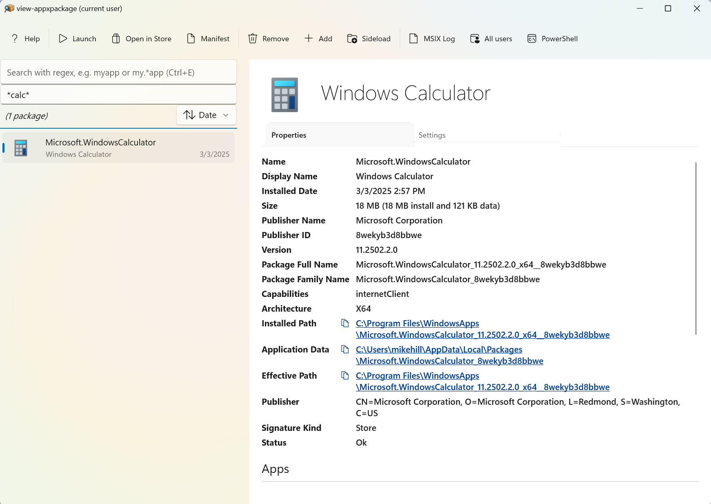

view-appxpackage
===

Use this app to view and manage MSIX packages on this device

[Full help info](./Package/Assets/Help.md)

# Install

[Microsoft Store](https://www.microsoft.com/store/productId/9MZ8SSBDQG3F?ocid=pdpshare)

_or_

`winget install view-appxpackage --source msstore`


# Sample screen




# Command line examples

```
view-appxpackage
view-appxpackage *calculator*
get-appxpackage | ? {$_.IsDevelopmentMode} | view-appxpackage
```

# App Actions

The application now supports **App Actions** that mirror the functionality of the MCP tools, making package information queries discoverable via Windows Search and context menu.

## Available App Actions

### 1. List Package Family Names
Lists all Package Family Names from loaded MSIX (AppX) packages.

**Usage:**
```cmd
# Command line
view-appxpackage.exe -action list
view-appx-list.exe

# Protocol activation
start view-appxpackage-list://
```

### 2. Get Package Properties
Gets detailed properties for a specific package family name.

**Usage:**
```cmd
# Command line
view-appxpackage.exe -action properties -param:packageFamilyName=Microsoft.WindowsCalculator_8wekyb3d8bbwe
view-appx-properties.exe Microsoft.WindowsCalculator_8wekyb3d8bbwe

# Protocol activation
start "view-appxpackage-properties://?packageFamilyName=Microsoft.WindowsCalculator_8wekyb3d8bbwe"
```

### 3. Find Packages by Property
Finds packages containing a specific property value.

**Usage:**
```cmd
# Command line
view-appxpackage.exe -action find -param:propertyName=Name -param:propertyValue=Calculator
view-appx-find.exe Name Calculator

# Protocol activation
start "view-appxpackage-find://?propertyName=Name&propertyValue=Calculator"
```

## Windows Search Integration

After installation, the App Actions are discoverable via Windows Search:
- Type "view-appx" to see available commands
- Search for "List Package", "Get Package Properties", or "Find Packages" to find the actions

## Help

```cmd
view-appxpackage.exe -help
view-appxpackage.exe -action help
```

For detailed testing information, see [TEST_APP_ACTIONS.md](./TEST_APP_ACTIONS.md).

